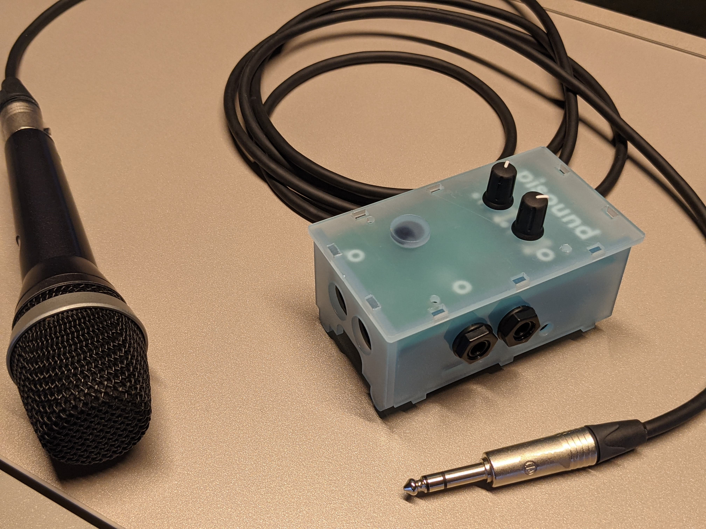

# choirbox

## Prerequisites

- 5 choirboxes assembled
- names are altered in `/etc/hosts` & `/etc/hostname` to choirbox1 - choirbox5

## demo setup
First decide who will act as server. We'll assume it is choirbox1. The config files are prepared as such.
You need the public IP adress of the Server, or the local adress if everyone is on the same network.
Port `4464` should be reacheable over TCP/IP
Port `61002`-`61012` should be reacheable over UDP

The other boxes should be started, make note of their public IP adresses, unless the boxes are all on the same network. You can find their address by connecting to the box using the pi-sound app (android only).

start the jacktrip Server  (using the pisound app > scripts > start jacktrip Server) on the server *TODO*

start the jacktrip Client on each of the clients (using the pisound app > scripts > start jacktrip Client) *TODO* 

run the connect scripts (should be run after all Clients are connected) on both client and server (this runs jackmess in the background) *TODO*

On the Client start the remote-metronome_client (using pisound app > pure-data-patches > remote-metronome_client) *ONGOING*

On the Server start the remote-metronome_main (using pisound app > pure-data-patches > remote-metronome_main) *ONGOING*

The interface allows control of the metronome, as well as the mix

## tests

1. test for minimal latency
	2. how is the experience for the singers?
3. Randomized latency: we have a set of latencies preprogrammed in pure data which we add artificially. The singers know there's going to be differences in latency and must depict if it is noteable or not. Since it is randomized, we hope to prevent a bias of the singers.
4. mix with or without your own voice

## usage of repository
### personas
<wie gebruikt er wat van scripts?>
### pure data
#### prerequisites
<welke files dienen we waar naar toe te kopieren?>

#### what are we using pure data 
#### what to install?
Normally nothing **if** you use the [patchbox OS image](https://blokas.io/patchbox-os/)