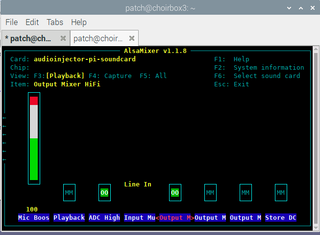
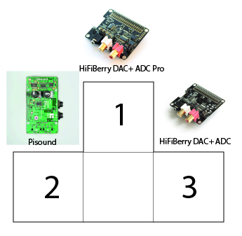
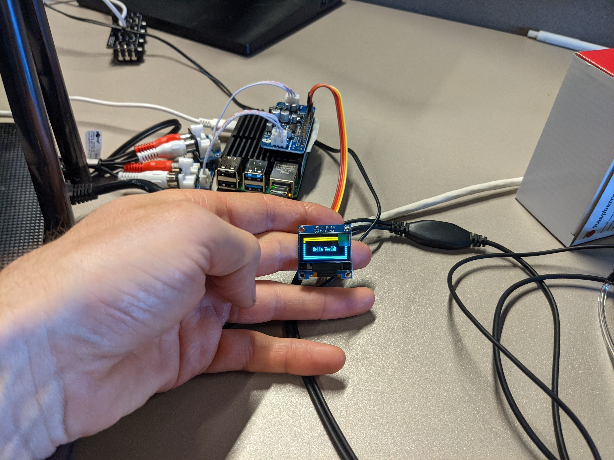

# hardware components

## compute engine

preferably use raspberry pi 4: gigabit ethernet

## soundcard

### goals

1. low latency:
	1. all latency measurements with an audio cable between physical in-and output, 48kHz, 64 audio samples as buffer. Latency measurement tool = jack_iodelay
	2. jackd itselves adds latency as well (software latency). To know the actual latency the audio card adds (ADC + DAC, or input and output combined), we have to subtract the software latency, being 1.333 ms. 
		1. measured on a raspberry pi, kernel 5.10.17-v7l+
2. audio input as well as output
   1. XLR/jack combi prefered input
   2. headphone out
3. good integration with raspberry pi/linux
4. price
5. chipset used?
6. audio quality
	1. We want to know if the preamp in the device is sufficient for non-line level microphones. For testing purposes I'll use a dynamic microphone, the AKG D5. 
	2. For connecting to the different audio boards, I'll have to use some conversion cables, which all of them only use 1 side of the differential XLR cable. Thus some noise can be added. (see [here](https://en.wikipedia.org/wiki/Differential_signalling) na [here](https://en.wikipedia.org/wiki/Balanced_circuit))

### pisound

[link](https://blokas.io/pisound/)

1. loopback latency: (according to the datasheet: 2.092ms)

>   236.236 frames      4.922 ms total roundtrip latency
> 
> 	extra loopback latency: 44 frames
> 
> 	use 22 for the backend arguments -I and -O
> 

So one way card latency: (4.922ms - 1.333ms)/2 = 1.795ms

2. stereo jack input & output
   1. no XLR input, only stereo jack. So no balanced signal as well (noise?)
   2. good
3. good integration (scripts presented)
4. expensive: Eur 99
5. Audio quality is good when using a dynamic microphone

### audioinjector zero raspberry pi sound card

[link](https://www.audioinjector.net/rpi-zero)

1. latency:
	> 218.996 frames      4.562 ms total roundtrip latency
	> 
	> extra loopback latency: 26 frames
	>
	> use 13 for the backend arguments -I and -O
	
So one way card latency: (4.562ms - 1.333ms)/2 = 1.615ms

2. stereo input & output
   1. via extension boards: RCA, stereo jack, volume meters
   2. No XLR (or balanced signal)
3. unknown
4. approx. Eur 14
5. [Cirrus Logic WM8731S](https://www.cirrus.com/products/wm8731/)

#### experiences

documentation is bad for soldering the device. Even though it's not hard, a clear view on what components to expect to be placed where is the bare minimum.

Also, raspberry pi header is delivered in the package, seems a strange/cheap choice for a device primarily targeted towards this.

Apparantly: `dtparam=i2s=on` needs to be added and via alsamixer we have to enable the hifimixer!

### audioinjector ultra 2

[link](https://shop.audioinjector.net/detail/Sound_Cards/Ultra+2)

1. latency
> 213.895 frames      4.456 ms total roundtrip latency
> 
> extra loopback latency: 21 frames
> 
> use 10 for the backend arguments -I and -O

So one way card latency: (4.562ms - 1.333ms)/2 = 1.615ms

2. stereo input & output
   1. via extension boards: RCA, stereo jack, volume meters
   2. No XLR (or balanced signal), yet capable!
3. unknown
4. approx. Eur 60
5. [Cirrus Logic cs4265](https://www.cirrus.com/products/cs4265/) + balanced to mono chip [TI OPA1692](https://www.ti.com/product/OPA1692)

#### experiences

documentation is bad for soldering the device. This one is harder to solder then the audioinjector zero card, and no clear documentation is added!

The entire setup feels flimsy, the SPDIF connector feels loose, stacking of boards is not that smooth.

Also, raspberry pi header is delivered in the package, seems a strange/cheap choice for a device primarily targeted towards this.

When hooking up to a raspberry pi, I had to change the device tree parameters following some instructions. Doing this and a reboot made the pi recognize the soundcard. Yet I was not able to record any audio with the device, only noise... Is it a faulty device? Is it a setting I'm not aware? Again: Documentation is needed!

Apparantly: `dtparam=i2s=on` needs to be added and via alsamixer we have to enable the hifimixer!

The amount of IO is a plus punt on this one.

### HifiBerry DAC+ ADC

[link](https://www.hifiberry.com/shop/boards/hifiberry-dac-adc/)

1. Latency:

>  222.805 frames      4.642 ms total roundtrip latency
>
>	extra loopback latency: 30 frames
>
>	use 15 for the backend arguments -I and -O

2. RCA output, 3.5mm input jack
   1. No balanced input
3. linux kernel > 4.18
4. approx Eur 42
5. [TI PCM1851 ADC](https://www.ti.com/product/PCM1851) + [TI PCM5122 audio DAC](https://www.ti.com/product/PCM5122)

- To get XLR input: you can not get balanced audio, you can get semi-balanced though (possibly more noise)
- To get stereo jack output, connect stereo Male RCA to stereo Female jack connector
- 1. one needs to adapt the devicetree overlay (in /boot/config.txt): `dtoverlay=hifiberry-dacplusadc` and reboot.
- You can control the **output** volume of the device, NOT the **input** volume.

So one way card latency: (4.642cms - 1.333ms)/2 = 1.655ms

### HiFiBerry DAC+ ADC Pro

[link](https://www.hifiberry.com/shop/boards/hifiberry-dac-adc-pro/)

1. latency:

	> 242.416 frames      5.050 ms total roundtrip latency
	> 
	> extra loopback latency: 50 frames
	> 
	> use 25 for the backend arguments -I and -O

2. RCA output, 3.5mm input jack
   1. No balanced input
3. linux kernel > 4.19.60
4. approx Eur 55
5. [TI PCM1863 ADC](https://www.ti.com/product/PCM1851) + [TI PCM5122 audio DAC](https://www.ti.com/product/PCM5122)

- To get XLR input: you can not get balanced audio, you can get semi-balanced though (possibly more noise)
- To get stereo jack output, connect stereo Male RCA to stereo Female jack connector

#### experiences

1. one needs to adapt the devicetree overlay (in /boot/config.txt): `dtoverlay=hifiberry-dacplusadcpro` and reboot.
- You can control the **output** as well as **input** volume of the device.

So one way card latency: (5.050cms - 1.333ms)/2 = 1.858ms

## summary

|card|one way latency (ms)|cost (&euro;)|connectivity|experience|
|---|---|---|---|---|
|pisound|1.795|99|2xmidi, 2x stereo jack, volume and gain potmeters, additional button|good build quality, potmeters and connectivity nice, good ecosystem (software)|
|audioinjector zero|1.615|14|expansion boards for RCA and jack|feels very cheap and not well designed. lot's of solderwork with no clear instructions. All of the sudden no sound?? Wouldn't count on it. No RPi header?|
|audioinjector ultra|1.615|60|expansion board with 4x stereo jack, possible to place XLR, SPDIF connection|lot's of connectivity, yet still feels very flimsy. Physical design not great. Audio Q good. No RPi header?|
|hifiberry dac+ adc|1.655|42|minijack audio in, RCA audio out|well built, good sound, no ADC gain though|
|hifiberry dac+ adc pro|1.858|55|minijack audio in, RCA audio out|bit more expensive than normal dac+ adc, more tweaking options and ADC gain|

## conclusion

I (Wouter Devriese 2021) would personally opt for either the HifiBerry Dac+ ADC Pro as best balance in terms of budget and features. The extra 13 &euro; in comparison with the normal dac+ adc give it more soundoptions, and make it possible to tweak the input gain. This way different microphones can be tweaked in a UI so that they don't distort yet aren't too quiet as well.

If more budget is allowed, the Pisound comes into picture as well, with the extra peripherals an interesting choice (midi, potmeters, button).

If budget constraints are rising, I'd go for the normal DAC+ ADC, it still has good value for the money.

 

## OLED screen

I tested the UCtronics UCT-602602 OLED screen (there are many companies making comparable alternatives).
By following [this](https://learn.adafruit.com/monochrome-oled-breakouts/python-usage-2) link it was possible to program the tiny, yet clear screen.

