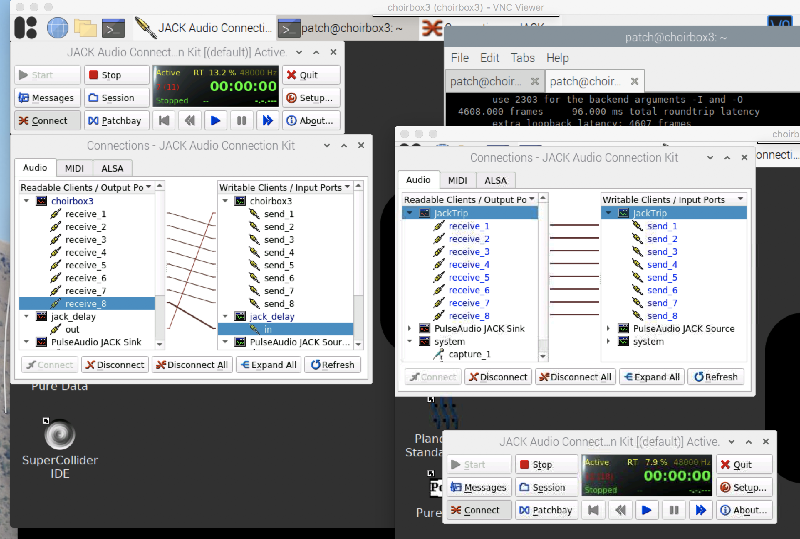

# initial testing

## master server

we pick choirbox1, running

`Linux choirbox1 4.19.71-rt24-v7l+ #1 SMP PREEMPT RT Wed Mar 11 17:15:58 EET 2020 armv7l GNU/Linux`

the 4.x branch RT kernel

## PD-patch for testing latency

- requires cyclone
- help > findexternals > cyclone

## test setups

### hardware

- all tests were run on RPI4B+ 8Gb
- connected to a TP-link off the shelf gigabit-switch and pingtimes between boxes of < 0.1ms

### jack_iodelay

jack_iodelay is a standard tool included with jack to measure the delay in a signal path. I ran the following tests

#### 2 RT kernel boxes using jacktrip -S (HUB mode)

```bash
$ uname -a
Linux choirbox1 4.19.71-rt24-v7l+ #1 SMP PREEMPT RT Wed Mar 11 17:15:58 EET 2020 armv7l GNU/Linux
```

running jackserver on one box:

```jacktrip -S```

and also

```jacktrip -C localhost --clientname choirbox1```

while on the other box

```jacktrip -C choirbox1 --clientname choirbox2```

results in 10.666 to 12ms delay when patching 
jack-iodelay out > choirbox2send > (jacktripserver receive) > (jacktripserver send choirbox2) > choirbox2 receive > jack_iodelay in
running

```jack_iodelay```

should give this output

```bash
512.000 frames     10.667 ms total roundtrip latency
extra loopback latency: 511 frames
use 255 for the backend arguments -I and -O
576.001 frames     12.000 ms total roundtrip latency
extra loopback latency: 576 frames
use 288 for the backend arguments -I and -O
```

patching an extra round to the jackserver over another channel gives:

```bash
896.000 frames     18.667 ms total roundtrip latency
extra loopback latency: 895 frames
use 447 for the backend arguments -I and -O
```

increasing the total number of roundtrips to 8 brings the number to 64ms, 74ms or 85ms
this is all using the default jacktrip settings 48KHz, 16bit, buffer 64 samples

```bash
---------------------------------------------------------
The Sampling Rate is: 48000
---------------------------------------------------------
The Audio Buffer Size is: 64 samples
                      or: 256 bytes
---------------------------------------------------------
The Number of Channels is: 8


3584.000 frames     74.667 ms total roundtrip latency
extra loopback latency: 3583 frames
use 1791 for the backend arguments -I and -O ?? Inv
4096.000 frames     85.333 ms total roundtrip latency
extra loopback latency: 4095 frames
use 2047 for the backend arguments -I and -O
```

#### 2 non RT kernel 5.4 boxes using jacktrip -S (HUB mode)

```bash
$ uname -a
Linux choirbox2 5.4.72-v7l+ #1356 SMP Thu Oct 22 13:57:51 BST 2020 armv7l GNU/Linux
```

running jackserver on one box:

```jacktrip -S```
and also

```jacktrip -C localhost --clientname choirbox1```

while on the other box

```jacktrip -C choirbox1 --clientname choirbox2```

results in

```bash
512.000 frames     10.667 ms total roundtrip latency
extra loopback latency: 512 frames
use 256 for the backend arguments -I and -O
512.000 frames     10.667 ms total roundtrip latency
extra loopback latency: 512 frames
use 256 for the backend arguments -I and -O
```

interestingly enough the exact same amount of delay as with the RT kernel
adding the ADC - DAC trip (by patching a real cable from out to in) results in roughly 5ms extra:

```bash
748.229 frames     15.588 ms total roundtrip latency
extra loopback latency: 748 frames
use 374 for the backend arguments -I and -O
```

back to the setup without ADC - DAC to test the network latency I'm moving to the same setup as used abouve using 8 channels as extra roundtrip

```bash
3584.000 frames     74.667 ms total roundtrip latency
extra loopback latency: 3583 frames
use 1791 for the backend arguments -I and -O
4608.000 frames     96.000 ms total roundtrip latency
extra loopback latency: 4608 frames
use 2304 for the backend arguments -I and -O
```

again almost identical to the RT kernel...

#### 2 non RT kernel 5.4 boxes using jacktrip -s (not the HUB mode)

```bash
576.000 frames     12.000 ms total roundtrip latency
extra loopback latency: 576 frames
use 288 for the backend arguments -I and -O
```

and for 8 channels loop

```bash
4608.000 frames     96.000 ms total roundtrip latency
extra loopback latency: 4607 frames
use 2303 for the backend arguments -I and -O
```

interestingly enough the peer to peer mode is a bit slower
but a bit more stable... every hop was exactly 12ms, in single hop en exactly 8 times more when I did 8.



to put things in perspective this is roundtrip latency, so back/forth. 12ms at speed of sound 300m/s (for sake of simplicity) is 3.6m It looks like some of the voices might be arriving too early compared to a real life stage setup... we do need to keep the number of jacktrip hops low, but with the server model this is not a problem if we can connect enough clients to a single server.

#### delay origins

via jack_iodelay

jacksettings:

> 128 frames buffer
>
> 48kHz
>
> n = 2 (period)

##### ADC + DAC latency

basis latency via ADC en DAC = framesize + DAC/ADC = 428.

Hieruit leiden we af dat DAC + ADC 300 frames in beslag neemt.

<screenshot>

#### best settings

> buffer 64
>
> 48000Hz
>
> redundancy omhoog
>
> kernel (rt/non-rt)

### testen in ASIL lab

Voorheen hadden tussen de muide en de krook 25ms roundtrip delay. In het ASIL lab liggen de waardes hoger.

 Rechtstreeks op de grote switch van het ASIL lab verkrijgen we 48ms loopback delay.

Om gecontroleerd te kunnen testen verbinden we, via statisch IP adres, 2 raspberry pi's met elkaar. De loopback delay dan is
 