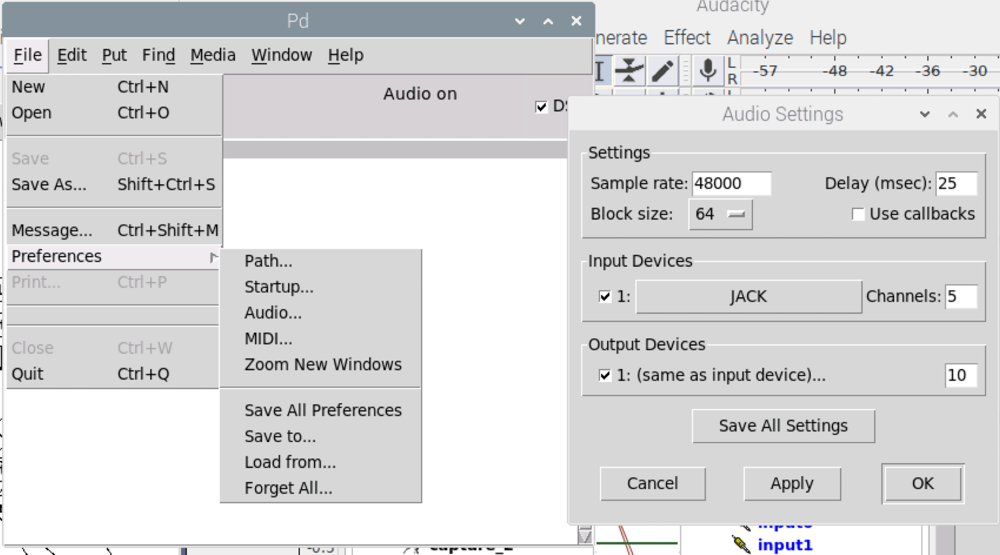
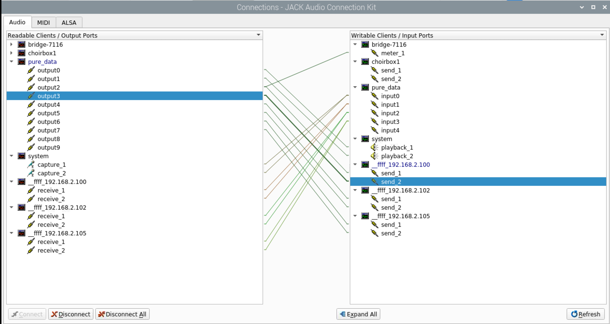
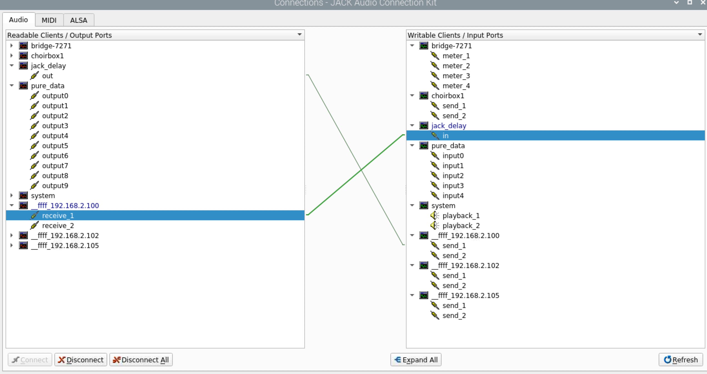
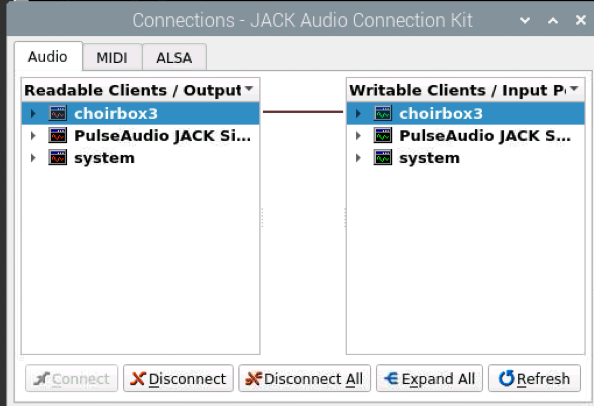
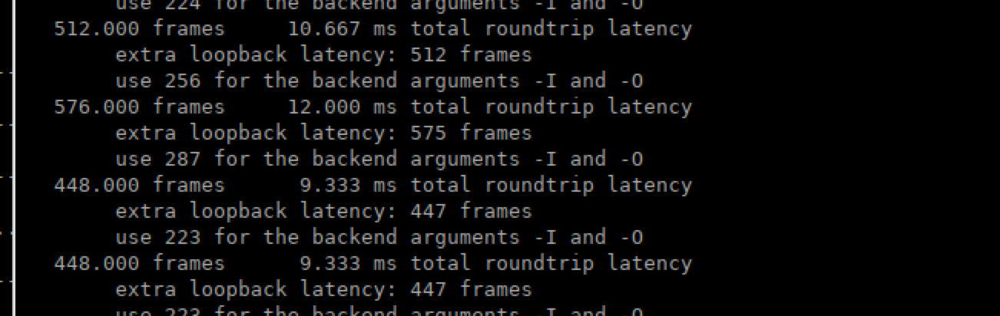
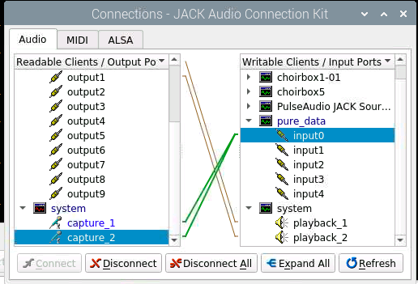

# quickstart raspberry pi setup

this is a shorter version of [setup](setup.md), focussing on the devices if the installation is already done.

## starting

There should be 1 RPi/computer serving as server, the others are clients.
As an example we'll take choirbox1 as server, 2 to 5 are clients (vocalists).

The server is also the one who uses the android application for mixing the sound.

### adapt RPI bashrc for easier connection

```bash
echo "alias jackclient='jacktrip -C choirbox1.local --clientname $HOSTNAME --udprt -n2 -K $HOSTNAME'" >> .bash_aliases

source .bashrc
```

### Qjackctl

On all devices, open qjackctl.

`qjackctl &`

### pure data patches

make sure the pd patches are copied to:

```bash
/usr/local/puredata-patches/
```

When connecting via bluetooth to the android app, we can choose which patch to launch.

**!Important for the master!**  Make sure that in pure-data preferences -> audio, we set the correct amount of channels to be used!



### Jacktrip

! important: when using patchbox OS, jack (audio) server is running in the background, so setting audio buffer for jack is done in patchbox (note, sometimes this failes, just try again, stupid bug I presume) via:

```bash
sudo patchbox-config
```

Then, on the server, we start the jacktrip server in HUB server mode:

```bash
jacktrip -S
```

On the clients, we'll use:

```bash
jacktrip -C choirbox1.local --clientname $HOSTNAME --udprt -n2 -K $HOSTNAME
```

or if the alias is used:

```bash
jackclient
```

### Virtual patching in Qjackctl

In QJackctl, go to setup and make sure the settings correspond to [jack setup](#jack_setup)
Or load them via jmess:

```bash
jmess -c choirbox1test.xml
```

### patching

#### master

Important on the master (Qjackctl): the master is a client as well, yet does not receive its inputs via jacktrip, but from the system. So we have to connect system to the pure data input, instead of the jacktrip receives.

The remote clients, of course, come into the jacktrip receives and should be patched this way.

#### clients

On the clients, we patch the system inputs to the jacktrip sends, and the jacktrip receives to the system outputs.

save configuration: `jmess -s $HOSTNAME.xml`

load patch configuration: `jmess -D && jmess -c $HOSTNAME.xml`
### hotspots

choirbox1:5 password blokaslabs

## steps

1. connect all choirboxes via vnc
2. go to 'master':
   1. `qjackctl &`
   2. `jacktrip -S`
   3. open android app and launc *remote_metronome_main*
   4. check in pure data that the correct amount of inputs and outputs are available
   5. new tab: `jacktrip -C choirbox1.local --clientname $HOSTNAME --udprt -n2`
   6. check the patchbay: disconnect all via `jmess -D`
   7. load patch via `jmess -c choirbox1test.xml`
   8. verify if audio arrives at the master by using a vu-meter: `meterbridge -t vu x x x x` and patch all incoming channels to each vu input
      1. You should see the incoming signals moving on the VU meter, also use it for patching the pd Outputs to the VU inputs, this way you can easily verify if the pure data patch is working as expected.
   9. Recap patch for master:
      2.  Output System goes to pd input ch 1
      3.  All other outputs from remote devices go to pd input ch 2 -...
      4.  Output pd 1 & 2 go to input system
      5.  Output pd 3 and up to remote device inputs
      6.  Example: 
   10. To check for roundtrip delay from master to other device:
      1.  On the master: `jack_iodelay` this creates new patch option
      2.  Wire as this: 
      3.  On the remote device (192.168.2.100 in this case), couple straight back: 
      4.  Results are shown in master terminal: 

## TODOs

1. cabling: For singing: XLR female to MONO jack is best option, doing this shorts the stereo end. This way it doens't matter if you patch the stereo input capture_1 **and** capture_2 to the pure_data input. . Doing this with a stereo cable negates the stereo signal with silence as an unwanted outcome.