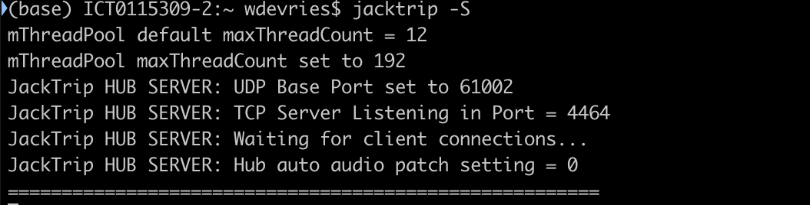

# setup

## Hardware

## Software

[alternative: tpf-client](https://gitlab.zhdk.ch/TPF/tpf-client)

[paper tpf-client](https://lac.linuxaudio.org/2019/doc/haefeli.pdf)

Use VNC Viewer for viewing the raspberry pi screen

### Patchbox raspberry pi image

[patchbox OS base image](https://blokas.io/patchbox-os/)

starting settings:

|function|username|password|
|-|-|-|
|ssh to $HOSTNAME|patch | blokaslabs|
|connecto to Wifi hotspot $HOSTNAME|-|blokaslabs|

### initial login

setup wizard:
| section |  choice |
| ---|---|
| update to latest | yes|
|soundcard| pisound|
| default boot option|desktop autologin|
|jack setup|48000/64/2 (check redundancy options if bandwith leaves some room.) |
| wifi setup|only for easy access, not for audio stream preferred|
| module|none: Default patchbox OS environment|

### Full install via choirbox repo

The choirbox repo changes the hostname, , updates the linux kernel, installs latest jacktrip & jmess, creates command aliases, and reboots

```bash
git clone https://github.com/imec-int/choirbox.git
cd choirbox
sudo chmod 755 install.sh
./install.sh
```

## commands

| command| alias for| adapt in script|
|-|-|-|
|jackclient| connect device as jackclient|[script location](./scripts/startup/jacktripClient/jacktripClient.sh)|
|jackserver| connect device as jackserver|[script location](./scripts/startup/jacktripServer/jacktripServer.sh)|
|jackpatch| patch device based on $HOSTNAME.xml, the xml is adapted for servers or clients separately|[script location](./scripts/startup/patching/patch.sh)|

### log messages

When jacktrip is started in Hub server mode:



Once a client connects you should see him appearing on the server terminal:


### BPM tapping

[python3 script](./scripts/python/metronome.py), necessary to install [gpiozero](https://gpiozero.readthedocs.io/en/stable/installing.html) via apt.
