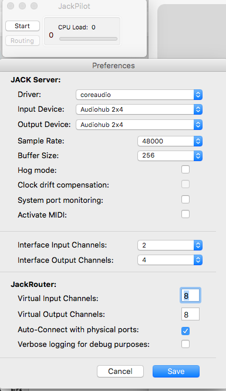

# phase 1 setup

## Hardware
## Software

[alternative: tpf-client](https://gitlab.zhdk.ch/TPF/tpf-client)

[paper tpf-client](https://lac.linuxaudio.org/2019/doc/haefeli.pdf) 

Use VNC Viewer for viewing the raspberry pi screen


### image

[patchbox OS base image](https://blokas.io/patchbox-os/)
 
### username/password
patch / blokaslabs
 
### initial login
setup wizard
update to latest
 
### soundcard
pisound

### default boot option
desktop autologin

### jack setup
48000/64/2
 
### wifi setup
only for easy access
 
### module

none: Default patchbox OS environment
 
### change hostname to something sensible
```
sudo nano /etc/hostname
```

I picked choirbox1 to choirbox3

### kernel PREEMPT
is enabled by default on the patchbox OS
but not on newest image...
stick to stock 5.4.x kernel at the moment

```
uname -v
```

> \#1 SMP PREEMPT RT Wed Mar 11 17:15:58 EET 2020 
 
### jack and jacktrip
changing fast due to high-paced development!

### dev env
```
sudo apt install -y --no-install-recommends build-essential librtaudio-dev qt5-default autoconf automake libtool make libjack-jackd2-dev qjackctl audacity git
```


### jacktrip

```
git clone https://github.com/jacktrip/jacktrip.git
```

To compile using the build script:

```
cd jacktrip/src
./build
cd ../builddir
sudo make install
cd
```

### jmess (patch connection state saving)

```
git clone https://github.com/jacktrip/jmess-jack.git
cd jmess-jack/jmess/src
./build
sudo make install
```

### time for a backup maybe?

!!! check actual disk names !!!!

```
sudo dd if=/dev/rdisk2 | gzip > pisound-jacktrip-img.gz
```


### connect 

```
jacktrip -C <IP> --clientname $HOSTNAME -n 8
``` 

### port forwarding

on your router make sure port 4464 is forwarding for TCP, port 61002 for UDP

## debugging

[iperf](https://www.haven2.com/index.php/use-iperf-to-test-port-forwarding-and-network-performance-between-participants-in-an-online-jam-session)
 
 
## starting
 
There should be 1 RPi/computer serving as server, the others are clients.

### Server
On the server, we must make sure jackd is running.

#### Mac OS X

Open Jackpilot. Adapt the settings according to [jack_setup](#jack_setup)
 
 Run Jackpilot, then QJackctl.
 
In QJackctl, go to setup and make sure the settings correspond to [jack setup](#jack_setup)
 
open a terminal:
 
``` 
jacktrip -S
``` 
to start jacktrip in Hub server mode:


Once a client connects you should see him appearing on the server terminal:

 
### clients
 
open a terminal and enter:

```
jacktrip -C <server IP> --clientname $HOSTNAME -n 2
``` 
open the pd patch on all clients
 
 

